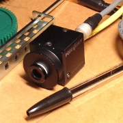

### Overview
This repository holds code of a [ROS](http://www.ros.org) package for image acquisition with [Black Fly](https://www.ptgrey.com/blackfly-gige-poe-cameras) camera. It is basically a ROS wrapper of the low-level API provided by [Ponit Grey](https://www.ptgrey.com/), the manufacturer of the camera. The ROS node can be configured to act as a server or as publisher at a given rate. 



### Dependencies
The package has been tested with the following dependencies:
* Ubuntu 16.04
* CMake + gcc
* [ROS Kinetic](http://wiki.ros.org/kinetic)
* [OpenCV v3.1 or 3.2](http://www.opencv.org/) (shipped with ROS Kinetic)
* [Forked](https://github.com/beta-robots/common_msgs) version of ROS common_msg metapackage. Clone it at your ROS workspace. 
* FlyCapture2 (propietary SDK from the manufacturer)

To install the FlyCapture2 SDK dependency:

1. Download the SDK from the [Point Grey's website](https://www.ptgrey.com/support/downloads)
2. Install it by following the instructions in the README file included in the download. 


### Download and build this ROS package
Download to your ROS workspace /src, with the command:
```shell
$ git clone https://github.com/beta-robots/ptgrey_bfly_camera.git
```
and from your ROS workspace, build it with:
```shell
$ catkin_make --only-pkg-with-deps ptgrey_bfly_camera
```

### ROS node configuration
Edit the .yaml file at config/ folder with the wished parameters. Specially set the run_mode, indicating if you want the camera to run as a SERVER (image as a service), or as a PUBLISHER (image streaming). 


### ROS node execution
Run the node (by default an rviz window will appear)
```shell
$ roslaunch ptgrey_bfly_camera ptgrey_bfly_camera.launch 
```
If the camera runs as a PUBLISHER, this node fulfills with the conventions specified [here](http://wiki.ros.org/image_pipeline#Hardware_Requirements), about topics and service naming. 

If the camera operates as a SERVER, please request the image service from another terminal, with the exposure parameter (0 means auto). [This service](https://github.com/beta-robots/common_msgs/blob/kinetic-devel/sensor_msgs/srv/SnapshotImage.srv) will respond with a concatenation of two ROS sensor messages: [Image](http://docs.ros.org/api/sensor_msgs/html/msg/Image.html) and [CameraInfo](http://docs.ros.org/api/sensor_msgs/html/msg/CameraInfo.html)
```shell
$ rosservice call /ptgrey_bfly_camera/image_server "exposure: 0"
```

### Intrinsics calibration and camera_info (topic and service)
The node will look for a yaml file, with the intrinsics calibration parameters, at folder /calibration. The camera_info topic will publish the parameters read from this file.
If there is no file available, the node will run anyway, but the camera_info topic will publish invalid data. In case you need a calibrated camera, execute a procedure such as [this one](http://wiki.ros.org/camera_calibration).  At the end of such procedure, tha calibration node will call a service implemented in the camera node, requesting to store the calibration data, so a calibration file will be created and the camera_info topic will publish the new calibration parameters found. 

### Troubleshooting
The tool flycap, installed with camera's manufacturer SDK, has a set of options to configure the camera, like setting the device IP among others. 
```shell
$ flycap
```


